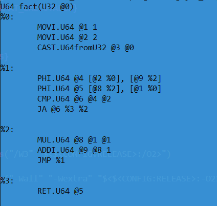

# Build and run
```
mkdir build
cd build
cmake ..
cmake --build . --target run_main
```
in output will be ir from generator



# If you want to run tests
```
cmake .. -DINCLUDE_TESTS=ON
cmake --build . --target run_tests
```
